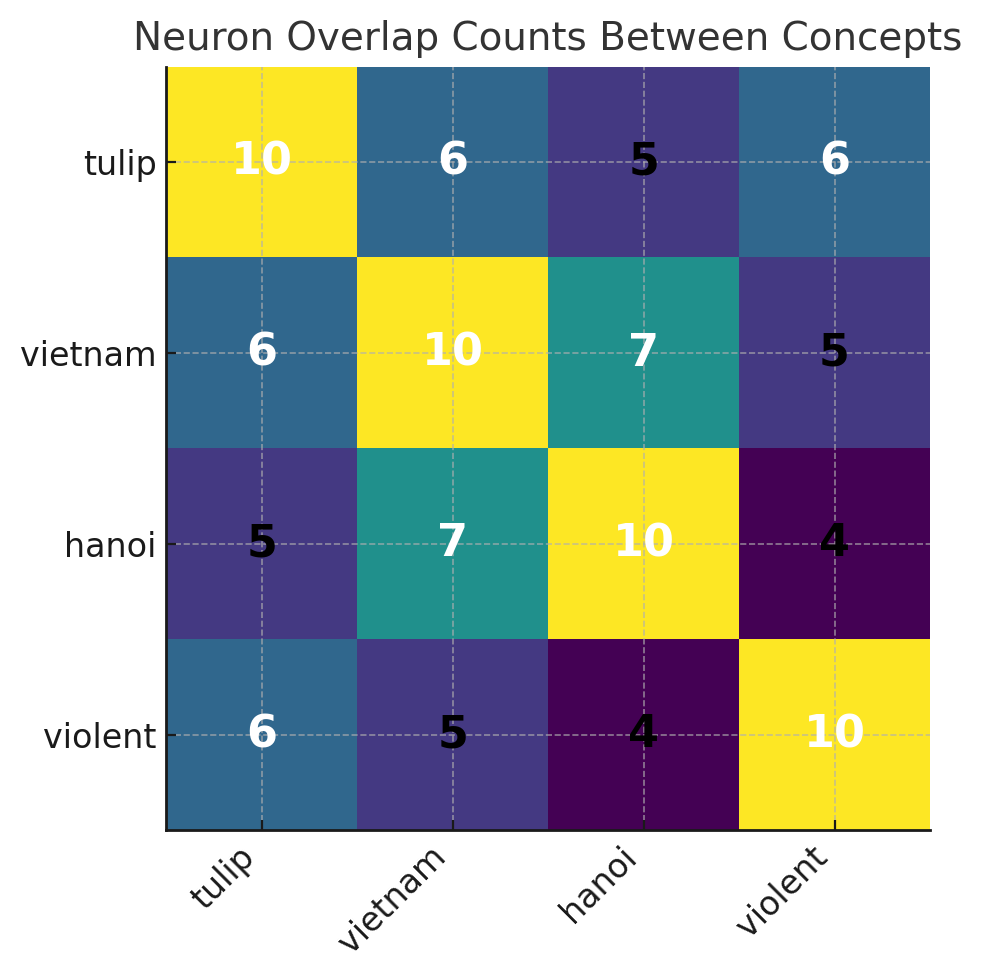
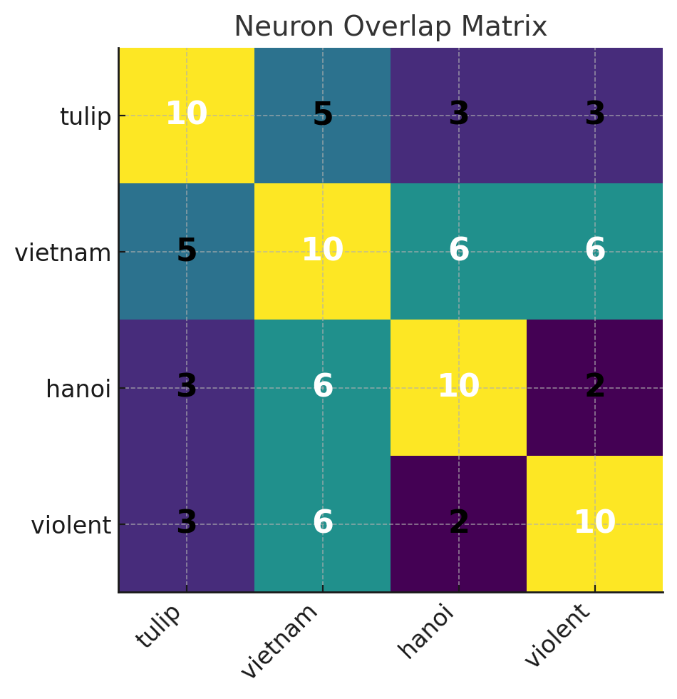

### neuron tracing


- Insight 10: Can we trace neurons that highly activate during the generation process? During multiple forward pass, we may be able to identify the role of specific neurons.

> The neuron tracing is focused on the hidden states of each transformer 
> block because these are most commonly understood as the "neurons" in transformer 
> models and tend to be where interpretable features are encoded.

>  The neuron trace procedure efficiently identifies the most influential neurons during model generation by attaching forward hooks
to each transformer layer that capture per-neuron activations for each new token.
As the model generates text autoregressively, these hooks record activations
at each timestep. After generation completes, the algorithm computes each
neuron's average activation across all tokens, then ranks and selects the
top K most active neurons as the "trace." 

> Lesson: Based on the observation that the neuron trace algorithm yields nearly 
> identical "highly activating neurons" across different concepts (e.g., Vietnam and tulips)

```markdown
Top 10 neurons most consistently activated by tulip content:
Rank  Layer  Neuron  Occurrences  % of Samples
   1     11     496           10       100.00%
   2     11     481           10       100.00%
   3     11     447           10       100.00%
   4     10     481           10       100.00%
   5     10     447           10       100.00%
   6     11     430           10       100.00%
   7     11      36           10       100.00%
   8      9     447           10       100.00%
   9      9     481           10       100.00%
  10     10     496           10       100.00%
```

> For whatever concept I am putting to the models (via prompts), the set of highly activating neurons appears to be the same.
> The issue arises because we are consistently picking neurons based solely 
> on their raw magnitude across all tokens or just the final token. 
> Certain neurons naturally have higher baseline activation magnitudes 
> across almost any text (often due to their position near output layers or due to learned bias 
> towards high-magnitude activation). Such neurons will always dominate if no 
> normalization or comparative metric is employed.


> Solution: Normalizing and Comparing Activation to a Baseline with the following equation:

> Concept-specific activation=activation_concept - activation_baseline

> Here is baseline prompts:

```json
{
  "prompts": [
    "The quick brown fox jumps over the lazy dog.",
    "She opened the window to let in fresh air.",
    "He walked to the store in the afternoon.",
    "Today's weather is rainy with overcast skies.",
    "They studied quietly in the library."
  ]
}
```

> After that, for "tulip", we have a set of neurons

```markdown
====================
Most consistent tulip neurons
====================
Max possible occurrences: 10
Rank  Layer  Neuron  Occurrences  %
   1     11      87            4   40.00%
   2     11     447            4   40.00%
   3     11     365            4   40.00%
   4     11     127            4   40.00%
   5     11     266            4   40.00%
   6     11     442            3   30.00%
   7     11     373            3   30.00%
   8     11     314            3   30.00%
   9     11     756            3   30.00%
  10     11     680            3   30.00%
```

> Interesting to see that the neurons locate at the very end of the network.

> TODO: Note that we are just using the activation of the last token here.

> Now, let's try with concept Vietnam.

```markdown
====================
Most consistent vietnam neurons
====================
Max possible occurrences: 10
Rank  Layer  Neuron  Occurrences  %
   1     11     314            7   70.00%
   2     11     756            6   60.00%
   3     11     706            6   60.00%
   4     11     479            6   60.00%
   5     11     365            5   50.00%
   6     11     447            4   40.00%
   7     11     680            4   40.00%
   8     11      86            3   30.00%
   9     10     756            3   30.00%
  10     11     266            3   30.00%
```

> Seems OK! With different concepts, we can see different neurons, although there are 6 overlapping neurons.

> Now let's do some vibe check! Vietnam is famous for Hanoi. So, if we put concept Hanoi 
> into the model, we should expect some overlapping neurons with concept "Vietnam".

```markdown
====================
Most consistent hanoi neurons
====================
Max possible occurrences: 10
Rank  Layer  Neuron  Occurrences  %
   1     11     365            7   70.00%
   2     11     756            6   60.00%
   3     10     756            6   60.00%
   4     11     314            5   50.00%
   5     11     479            5   50.00%
   6     11     706            4   40.00%
   7      9     756            4   40.00%
   8     11     459            4   40.00%
   9     11     447            3   30.00%
  10     11      87            3   30.00%
```

> There are 6 overlapping neurons with Vietnam and has 5 overlapping neurons with tulip.
> Interesting, maybe they are all nouns. Let's try to have a very different concept here.

```markdown
====================
Most consistent violent neurons
====================
Max possible occurrences: 10
Rank  Layer  Neuron  Occurrences  %
   1     11     680            7   70.00%
   2     11     314            5   50.00%
   3     11     447            4   40.00%
   4     11     679            4   40.00%
   5     11     706            4   40.00%
   6     11     266            4   40.00%
   7     11      64            4   40.00%
   8     11      87            4   40.00%
   9     11     373            4   40.00%
  10     11     540            3   30.00%
```

> We perform an overlap analysis on the top neurons of 4 concepts. we have:

 

> We see that the lowest overlapping is between hanoi and violent.


> We still see much overlapping between concepts. Now, an apparent improvement
> is that we can use the activation for all **new generate tokens** rather than 
> just using the last generated token. Please note that doing this will make the computation
> much more expensive (e.g you generate 500 new tokens --> cost more than 500 times than using just
> one last token).

> From the code, when you set neuron_trace_all_positions=False, 
> you only record activations at the very last generated token of each sample. 
> With =True, you record activations at every new token (after the prompt) 
> and aggregate them. Now, let's see what neurons we have after using all activations.

```markdown
====================
Most consistent tulip neurons
====================
Max possible occurrences: 10
Rank  Layer  Neuron  Occurrences  %
   1     11     365            8   80.00%
   2     11     756            5   50.00%
   3     11     447            4   40.00%
   4     11     314            4   40.00%
   5     11     127            4   40.00%
   6     11     642            4   40.00%
   7     10     365            3   30.00%
   8     11     704            3   30.00%
   9     11     266            3   30.00%
  10     11      87            3   30.00%


====================
Most consistent vietnam neurons
====================
Max possible occurrences: 10
Rank  Layer  Neuron  Occurrences  %
   1     11     756            7   70.00%
   2     11     314            6   60.00%
   3     11     365            5   50.00%
   4     11      86            4   40.00%
   5     10     756            4   40.00%
   6     11     706            4   40.00%
   7     11     266            4   40.00%
   8     11      87            4   40.00%
   9     11     479            3   30.00%
  10     11     679            3   30.00%

====================
Most consistent hanoi neurons
====================
Max possible occurrences: 10
Rank  Layer  Neuron  Occurrences  %
   1     11     365            7   70.00%
   2     11     314            6   60.00%
   3     11     756            6   60.00%
   4     10     756            6   60.00%
   5      9     756            5   50.00%
   6     11     479            5   50.00%
   7     11     459            5   50.00%
   8     11     706            4   40.00%
   9     11     670            3   30.00%
  10     10     459            3   30.00%


Most consistent violent neurons
====================
Max possible occurrences: 10
Rank  Layer  Neuron  Occurrences  %
   1     11     197            6   60.00%
   2     11     373            5   50.00%
   3     11     680            5   50.00%
   4     11     314            4   40.00%
   5     11      86            4   40.00%
   6     11     679            4   40.00%
   7     11     706            4   40.00%
   8     11     266            4   40.00%
   9     11      64            4   40.00%
  10     11      87            4   40.00%
```

> Here we perform overlap analysis again and compare with using only the activation from last generated token.

| Last token only                  | All generated tokens             |
|----------------------------------|----------------------------------|
|  |  |

> Wow!!! We clearly see the improvements. Now, concepts have more distinctive neurons.